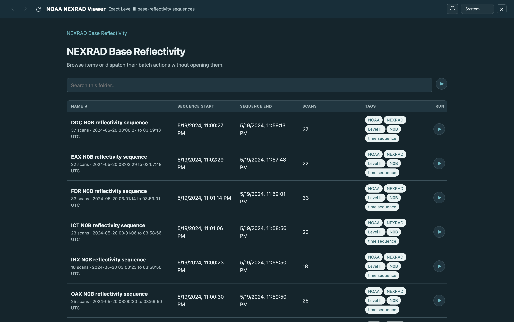
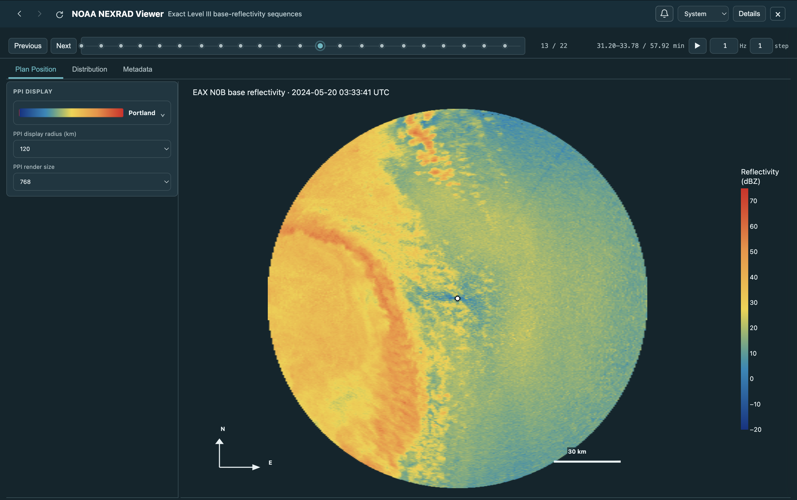

# NOAA NEXRAD Viewer

A focused local browser for native NOAA NEXRAD Level III
super-resolution base-reflectivity sequences. This is intentionally one
Sigvue `Workspace`, so opening the application goes directly to NEXRAD
sequence discovery instead of showing a workspace catalog.

## Preview

The single-workspace landing page presents every downloaded radar sequence in
one searchable table, including its scan count and time coverage:



Opening a sequence provides segmented playback, display controls, and the
native Level III base-reflectivity PPI:



The same workspace can render every native scan as a deterministic,
full-resolution animation:

<p align="center">
  
</p>

The repository is self-contained:

```text
src/nexrad_viewer/
├── formats/nexrad/    exact native Level III models and parser
├── reader.py          chronological sequence discovery
├── workspace.py       one Reader + one view callback + one Workspace
├── view.py            controls, statistics, tabs, tables, and layout
├── analysis.py        exact grids and sequence-wide histogram limits
├── plots.py           PPI and native-gate distribution figures
├── batch.py           durable full-resolution GIF rendering
├── style.py           local Plotly styling
└── download.py        NOAA archive discovery and validated downloads
```

## Install and download

Install Sigvue and this repository:

```bash
python -m pip install -e ../Scientific-Workspace-Browser
python -m pip install -e .
```

Download ten fixed one-hour cases from TLX, FDR, VNX, ICT, DDC, INX, SGF,
EAX, OAX, and TWX:

```bash
python scripts/download_data.py
```

The script queries NOAA's public Level III bucket for the selected fixed
prefixes. Downloads are atomic and checked against the bucket's object size
and, when supplied as a simple ETag, MD5 digest. No filename manifest is
needed. For a small trial:

```bash
python scripts/download_data.py \
  --cases tlx-oklahoma-city \
  --scans-per-case 3
```

See the available scan counts and total download size without downloading:

```bash
python scripts/download_data.py --list
```

## Run

```bash
sigvue --config browser.toml
```

Open <http://127.0.0.1:8000>. Because `browser.toml` contains exactly one
workspace, the root page is the NEXRAD sequence browser. Its ten collection
folders are deliberately flattened into ten sequence rows without changing
their identifiers or source locations. Selecting a sequence opens segmented
scan playback with:

- previous, next, press-and-hold, automatic playback, looping, and step size;
- a progressive plan-position reflectivity display;
- the visual colormap picker, including the custom NEXRAD scale;
- fixed native dBZ limits and viewport-aware rasterization;
- exact native-gate distributions, statistics, and metadata.

Each sequence row also has a **Render full-resolution GIF** batch action. The
workspace-level action renders every discovered sequence. Frames use native
range-gate spacing over the configured radius, bypass viewport raster
reduction, loop continuously, and are saved deterministically under
`outputs/`. Existing GIFs are recognized as complete after a restart.

Scientific values remain native. Cartesian resampling and viewport
rasterization are display operations only.

## Test

```bash
python -m pip install -e ".[test,release]"
python -m pytest -q
python -m build
python -m twine check dist/*
```

The source dataset is NOAA NEXRAD Open Data distributed through the NOAA Open
Data Dissemination program. NOAA requests attribution when the data is used.
