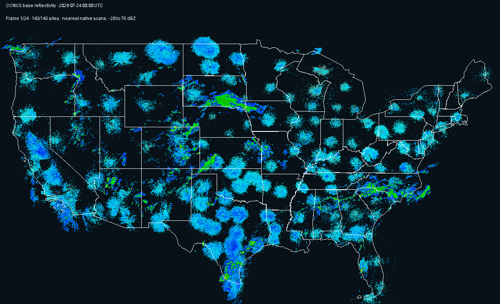
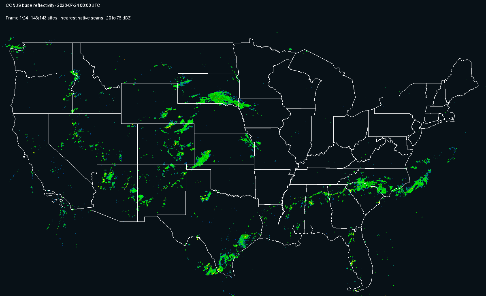

# NOAA NEXRAD Viewer

A focused local application for native NOAA NEXRAD Level III
super-resolution base reflectivity, built with
[Sigvue](https://github.com/briday1/sigvue). One shared date-oriented dataset
feeds two workspaces:

- **Individual Radar Sites** browses `date → radar sequence`, with segmented
  scan playback and exact native-gate inspection.
- **CONUS Radar Mosaic** treats each date as one synchronized dataset and
  shows the nearest scan from every available site on a minimal U.S. map.

Both run in an ordinary browser or the packaged desktop window. Both also
provide deterministic batch output.

## Preview

Choose a date folder and then a radar sequence in the site workspace:


The site view provides segmented playback, display controls, and a
georeferenced native Level III base-reflectivity map:


Its batch action renders each native scan as a full-resolution animation:

<p align="center">
  
</p>

## Install

Install the viewer with desktop support:

```bash
python -m pip install -e ".[desktop]"
```

## Get a full day of national data

The repository downloader queries NOAA's public Level III archive and the
current NOAA/NCEI NEXRAD station catalog. A dated download selects every
current CONUS site and, by default, keeps the nearest exact native scan at
each hourly boundary:

```bash
python scripts/download_data.py --date 2026-07-24
```

That command creates this shared layout:

```text
data/
└── 2026-07-24/
    ├── ABR_N0B_2026_07_24_00_02_28
    ├── ABR_N0B_2026_07_24_01_00_35
    ├── ...
    └── YUX_N0B_2026_07_24_22_58_33
```

There is no manifest and no duplicate mosaic format. Completed native files
appear atomically in the date folder; in-progress files stay in a hidden
staging directory outside the discovery root. One interrupted or malformed
object is skipped rather than preventing other radar data from opening.

Choose another temporal cadence without changing any scan values:

```bash
# One nearest native scan per site every 15 minutes
python scripts/download_data.py --date 2026-07-24 --cadence-minutes 15

# Every archived native scan (large)
python scripts/download_data.py --date 2026-07-24 --all-scans

# A bounded test
python scripts/download_data.py \
  --date 2026-07-24 \
  --sites KTLX KTWX \
  --hours 0 1 \
  --cadence-minutes 30
```

Use `--list` to obtain the exact matching scan count and byte total without
downloading. Use `--all-regions` to include current non-CONUS NOAA sites.
Running the script without arguments retains the compact ten-site,
one-hour 2024 example.

The downloader is repository test/data tooling. It is intentionally absent
from the installed package, wheel, and console entry points.

## Run

Launch the native desktop application:

```bash
nexrad-viewer-desktop
```

Or use an ordinary browser:

```bash
nexrad-viewer
```

The launcher uses the checkout's `data/` and `outputs/` directories by
default. Custom durable paths and all normal Sigvue server/batch arguments
remain available:

```bash
nexrad-viewer --port 9000
nexrad-viewer --data-root /path/to/radar --output-root /path/to/results
nexrad-viewer batch --list
```

An explicit profile is optional:

```bash
nexrad-viewer --config browser.toml
```

Then open <http://127.0.0.1:8000>.

### Individual Radar Sites

The workspace preserves top-level ISO date folders. Opening a date reveals
one sequence per radar/product; opening a sequence provides:

- previous, next, press-and-hold, playback speed, looping, and step size;
- a progressive geographic radar map with a visual colormap picker;
- fixed native dBZ limits and viewport-aware rasterization;
- exact native-gate distributions, statistics, and metadata.

Each sequence can render a full-resolution Plan Position GIF. Every frame is
the actual interactive Plotly Plan Position figure—not a separate batch
plot—with the scan's full native radar range, Portland colors, the dark
theme, and source pixels matched to native range-gate spacing. The batch path
bypasses viewport reduction and saves deterministically under `outputs/`.
This exact Plotly export uses Kaleido and needs Google Chrome; if Chrome is
not already installed, run `plotly_get_chrome`.

### CONUS Radar Mosaic

Each ISO date folder is one national item. The segmented time control moves
through fixed target times—hourly by default. At every target, each site
contributes its nearest native scan within the configured tolerance. The map
samples exact native gates onto a display grid and uses maximum reflectivity
where radar coverage overlaps; source gates are never averaged or modified.



The date-level batch action exports the complete synchronized map history as
a looping GIF. For the default hourly download cadence, a full-day dataset
becomes 24 full-CONUS frames. The batch animation masks reflectivity below
20 dBZ so weak clear-air returns do not obscure larger weather systems; it
does not rescale or average the surviving native values. The interactive
viewer continues to expose the complete fixed dBZ range.

<p align="center">
  
</p>

The interactive map includes:

- official U.S. Census state boundaries bundled for offline use;
- the custom NEXRAD scale and the same visual colormap picker;
- progressive viewport rendering that can be disabled;
- an editable source resolution and radar radius up to the scans' complete
  native extent;
- hoverable radar locations and exact per-site source times;
- loaded-buffer memory and alignment statistics.

Its batch action renders every synchronized frame at a configured
high-resolution grid, uses every scan's complete native radar range, applies
the configured event threshold (20 dBZ by default), and writes one looping
GIF per date. The batch path bypasses interactive viewport rasterization.

Run that export from the date row's action button in the browser, or dispatch
it directly:

```bash
nexrad-viewer batch \
  --workspace nexrad-national \
  --item 2026-07-24 \
  --action render-national-mosaic-gif
```

The resulting filename records the alignment cadence, event threshold, map
width, and frame duration, and the durable artifact is written under
`outputs/`. If the file already exists, Sigvue shows the action as
`rerun`; launching it regenerates the deterministic artifact in place.

## Data accuracy and provenance

The parser retains every unsigned byte from the native Level III packet.
Codes for below-threshold and range-folded gates remain distinct from
measured reflectivity. Cartesian PPI sampling, national map sampling, overlap
selection, and progressive rasterization are presentation operations; they
do not rewrite source data.

The source data is NOAA NEXRAD Open Data distributed through the NOAA Open
Data Dissemination program. Station IDs and locations come from NOAA/NCEI's
current HOMR NEXRAD station report. State outlines are a packaged extract
from the official U.S. Census TIGERweb States layer.

## Native desktop build

Build the platform-native PyInstaller artifact:

```bash
nexrad-viewer-build
```

On macOS this produces `dist/NEXRAD Viewer.app`; Windows and Linux produce a
platform executable. Each target must be built on its target operating
system.

When the checkout contains `data/`, the default build embeds it. To keep a
large national dataset external:

```bash
nexrad-viewer-build --without-data
nexrad-viewer-desktop --data-root /path/to/radar
```

The frozen app writes results only to the platform application-data folder,
never into its bundle. Sigvue's fullscreen control toggles the native window
in desktop mode and browser fullscreen in browser mode.

## Test and package

```bash
python -m pip install -e ".[test,release]"
python -m pytest -q
python -m build
python -m twine check dist/*
```
